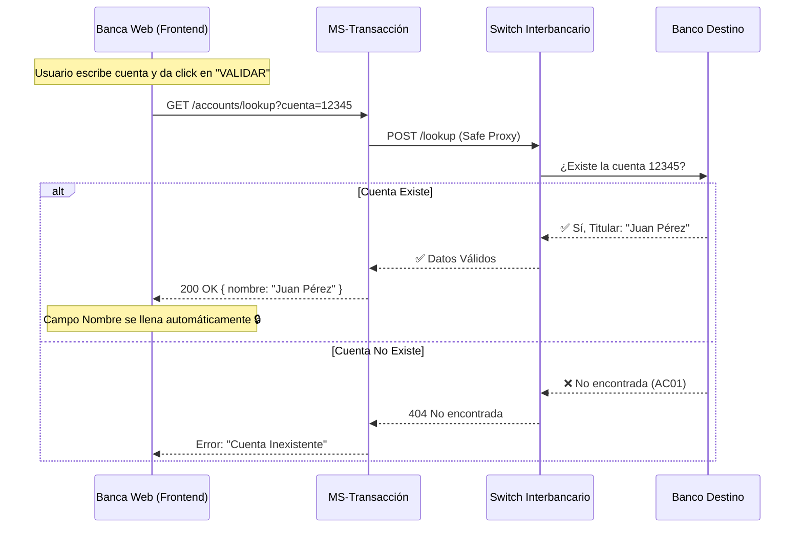
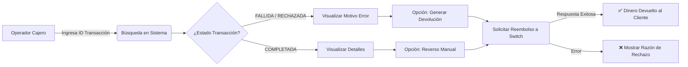
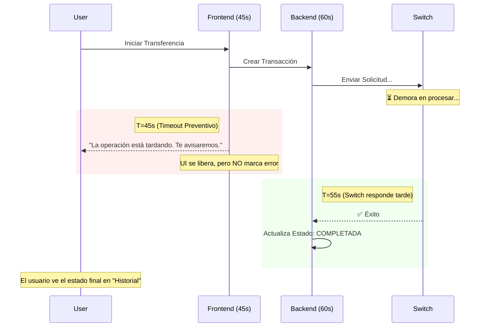
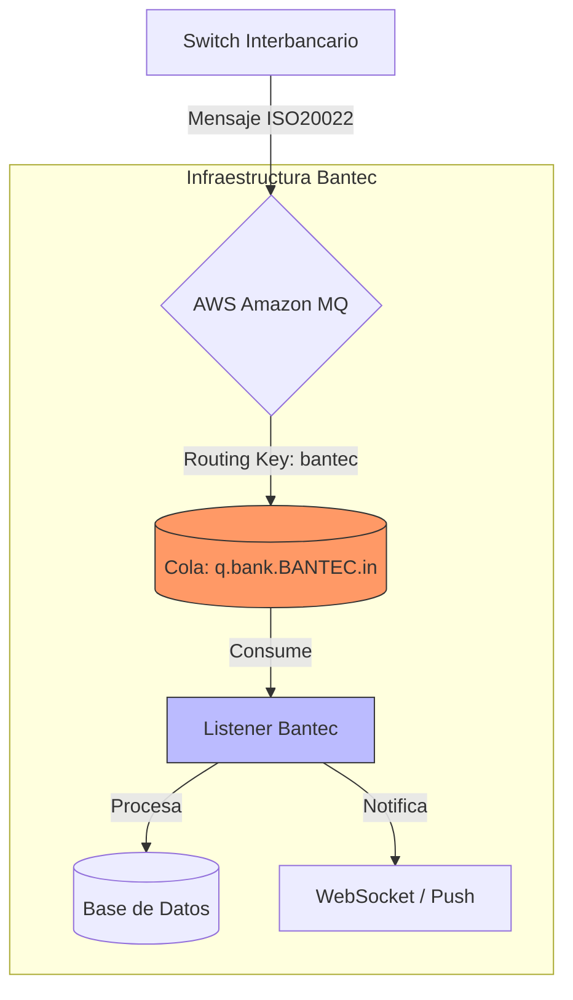

# Resumen de Cambios del Proyecto & Arquitectura
**Período:** 26 de Enero - 02 de Febrero 2026

---

## 1. Validación de Clientes (Account Lookup)
**Objetivo:** Eliminar la incertidumbre en las transferencias implementando un sistema de validación previa ("Look before you leap").

**Mejoras Clave:**
*   **Validación Dual:** Verificación bidireccional inmediata. No solo validamos que la cuenta exista, sino que el cliente sea quien dice ser.
*   **Seguridad Frontend:** El campo "Nombre de Beneficiario" ahora es inmutable (solo lectura), blindando el sistema contra errores de dedo o fraude en la captura manual.
*   **Integración Switch:** `ms-transaccion` ahora interroga al Switch antes de mover un solo centavo.

### Diagrama de Flujo: Validación de Cuentas

---

## 2. Gestión de Devoluciones (Frontend Cajero)
**Objetivo:** Proveer a los cajeros de una herramienta especializada para resolver reclamos y reversos manuales con claridad operativa.

**Mejoras Clave:**
*   **Módulo Dedicado:** Migración a `GestionDevoluciones.jsx`. Separar el flujo de "hacer transferencias" del flujo de "arreglar problemas" reduce la carga cognitiva del operador.
*   **Visibilidad Total:** UI expandida para mostrar la trazabilidad completa: Banco Origen, Destino y el *Motivo Técnico* real del rechazo (traducido a lenguaje humano).

### Diagrama de Flujo: Proceso de Devolución Manual

---

## 3. Corrección de Horas y Sincronización (Timeouts)
**Objetivo:** Resolver el problema de las "transacciones fantasmas" causadas por desfaces de tiempo entre sistemas.

**Mejoras Clave:**
*   **Alineación de Timeouts:** Se ajustó el Frontend (45s) y Backend (60s). El frontend deja de esperar *antes* que el backend termine, evitando que el usuario reintente una operación que ya estaba en curso.
*   **Consistencia de Estados:** Garantía de que una transacción `QUEUED` (Encolada) o `ACCEPTED` termine con una fecha de finalización real, no la fecha de inicio.

### Diagrama de Secuencia: Estrategia de Timeouts

---

## 4. Integración RabbitMQ (Prevención de Pérdida de Datos)
**Objetivo:** Desacoplar los servicios críticos para que ningún dato se pierda, incluso si un servicio se cae momentáneamente.

**Mejoras Clave:**
*   **Colas Nominadas:** Implementación de cola `q.bank.BANTEC.in` para recepción segura de mensajería asíncrona.
*   **Procesamiento Background:** Los listeners procesan las confirmaciones sin bloquear el hilo principal de la aplicación.

### Diagrama de Arquitectura de Mensajería

