# Resumen de Cambios del Proyecto & Arquitectura
**Período:** 26 de Enero - 02 de Febrero 2026

---

## 1. Validación de Clientes (Account Lookup)
**Objetivo:** Eliminar la incertidumbre en las transferencias implementando un sistema de validación previa ("Look before you leap").

**Mejoras Clave:**
*   **Validación Dual:** Verificación bidireccional inmediata. No solo validamos que la cuenta exista, sino que el cliente sea quien dice ser.
*   **Seguridad Frontend:** El campo "Nombre de Beneficiario" ahora es inmutable (solo lectura), blindando el sistema contra errores de dedo o fraude en la captura manual.
*   **Integración Switch:** `ms-transaccion` ahora interroga al Switch antes de mover un solo centavo.

### Diagrama de Flujo: Validación de Cuentas

```mermaid
sequenceDiagram
    participant UI as Banca Web (Frontend)
    participant MS as MS-Transacción
    participant SW as Switch Interbancario
    participant EXT as Banco Destino

    Note over UI: Usuario escribe cuenta y da click en "VALIDAR"
    UI->>MS: GET /accounts/lookup?cuenta=12345
    MS->>SW: POST /lookup (Safe Proxy)
    SW->>EXT: ¿Existe la cuenta 12345?
    
    alt Cuenta Existe
        EXT-->>SW: ✅ Sí, Titular: "Juan Pérez"
        SW-->>MS: ✅ Datos Válidos
        MS-->>UI: 200 OK { nombre: "Juan Pérez" }
        Note over UI: Campo Nombre se llena automáticamente 🔒
    else Cuenta No Existe
        EXT-->>SW: ❌ No encontrada (AC01)
        SW-->>MS: 404 No encontrada
        MS-->>UI: Error: "Cuenta Inexistente"
    end
```

---

## 2. Gestión de Devoluciones (Frontend Cajero)
**Objetivo:** Proveer a los cajeros de una herramienta especializada para resolver reclamos y reversos manuales con claridad operativa.

**Mejoras Clave:**
*   **Módulo Dedicado:** Migración a `GestionDevoluciones.jsx`. Separar el flujo de "hacer transferencias" del flujo de "arreglar problemas" reduce la carga cognitiva del operador.
*   **Visibilidad Total:** UI expandida para mostrar la trazabilidad completa: Banco Origen, Destino y el *Motivo Técnico* real del rechazo (traducido a lenguaje humano).

### Diagrama de Flujo: Proceso de Devolución Manual

```mermaid
graph LR
    A[Operador Cajero] -->|Ingresa ID Transacción| B(Búsqueda en Sistema)
    B --> C{¿Estado Transacción?}
    
    C -- "FALLIDA / RECHAZADA" --> D[Visualizar Motivo Error]
    D --> E[Opción: Generar Devolución]
    
    C -- "COMPLETADA" --> F[Visualizar Detalles]
    F --> G[Opción: Reverso Manual]
    
    E --> H(Solicitar Reembolso a Switch)
    G --> H
    
    H -->|Respuesta Exitosa| I[✅ Dinero Devuelto al Cliente]
    H -->|Error| J[❌ Mostrar Razón de Rechazo]
```

---

## 3. Corrección de Horas y Sincronización (Timeouts)
**Objetivo:** Resolver el problema de las "transacciones fantasmas" causadas por desfaces de tiempo entre sistemas.

**Mejoras Clave:**
*   **Alineación de Timeouts:** Se ajustó el Frontend (45s) y Backend (60s). El frontend deja de esperar *antes* que el backend termine, evitando que el usuario reintente una operación que ya estaba en curso.
*   **Consistencia de Estados:** Garantía de que una transacción `QUEUED` (Encolada) o `ACCEPTED` termine con una fecha de finalización real, no la fecha de inicio.

### Diagrama de Secuencia: Estrategia de Timeouts

```mermaid
sequenceDiagram
    participant User
    participant Front as Frontend (45s)
    participant Back as Backend (60s)
    participant Switch

    User->>Front: Iniciar Transferencia
    Front->>Back: Crear Transacción
    Back->>Switch: Enviar Solicitud...
    
    Note over Switch: ⏳ Demora en procesar...
    
    rect rgb(255, 240, 240)
        Note left of Front: T=45s (Timeout Preventivo)
        Front-->>User: "La operación está tardando. Te avisaremos."
        Note over Front: UI se libera, pero NO marca error
    end
    
    rect rgb(240, 255, 240)
        Note right of Back: T=55s (Switch responde tarde)
        Switch-->>Back: ✅ Éxito
        Back->>Back: Actualiza Estado: COMPLETADA
    end
    
    Note over User: El usuario ve el estado final en "Historial"
```

---

## 4. Integración RabbitMQ (Prevención de Pérdida de Datos)
**Objetivo:** Desacoplar los servicios críticos para que ningún dato se pierda, incluso si un servicio se cae momentáneamente.

**Mejoras Clave:**
*   **Colas Nominadas:** Implementación de cola `q.bank.BANTEC.in` para recepción segura de mensajería asíncrona.
*   **Procesamiento Background:** Los listeners procesan las confirmaciones sin bloquear el hilo principal de la aplicación.

### Diagrama de Arquitectura de Mensajería

